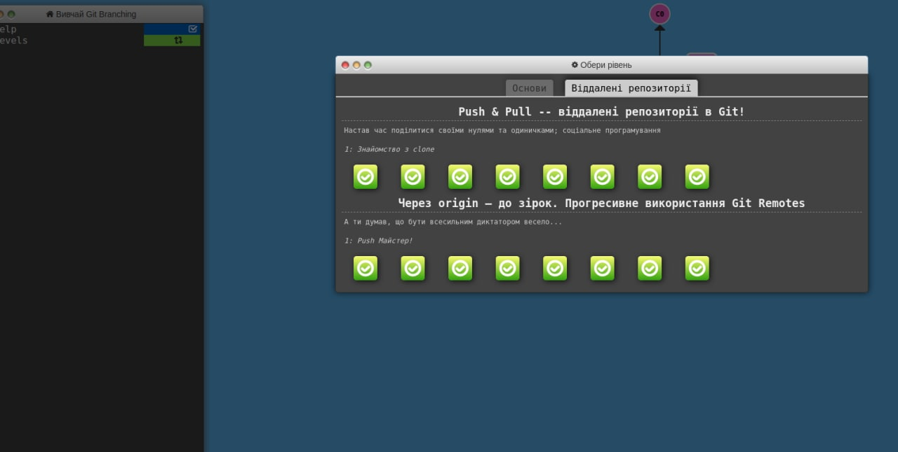
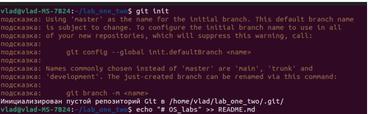
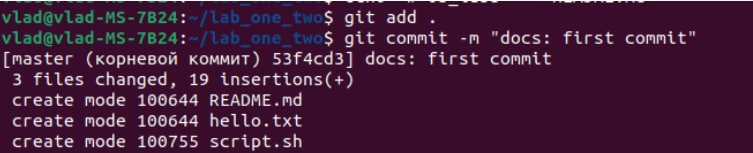
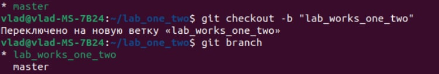
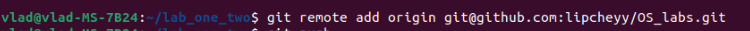
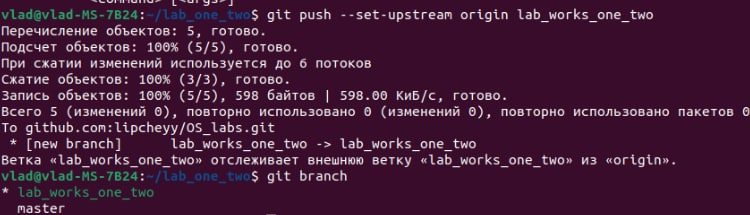

# Лабораторна робота №2
## **Основні команди системи контролю версій Git.**
<br>
Виконав студент 2 курсу <br>
ФІТ ІПЗ-1.2 <br>
Липчей Владислав Васильович

&nbsp;
### **Пройдені всі рівні розділу по основним командам git**


&nbsp;
### **Пройдені всі рівні по командам git для віддаленого репозиторію**


&nbsp;
### **Створено локальний репозиторій та файл README.md тазаписую в нього деякі дані**

```
    git init
    git echo "ttt" >> README.md
```
&nbsp;
### **Додаємо всі елементи в staging area та робимо комміт**

```
    git add .
    git commit -m "message"
```
&nbsp;
### **Створюю нову вітку lab_works_one_two, також провірю список моїх гілок**

```
    git checkout -b "branchName"
```
&nbsp;
### **Підключаюся до віддаленого репозиторія**

```
    git remote add origin link
```
&nbsp;
### **Відправляю всі файли з  staging area на віддалений репозиторій**


```
    git push
```