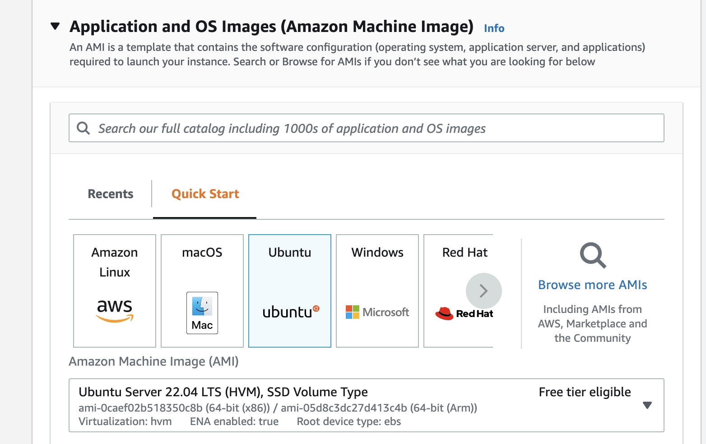
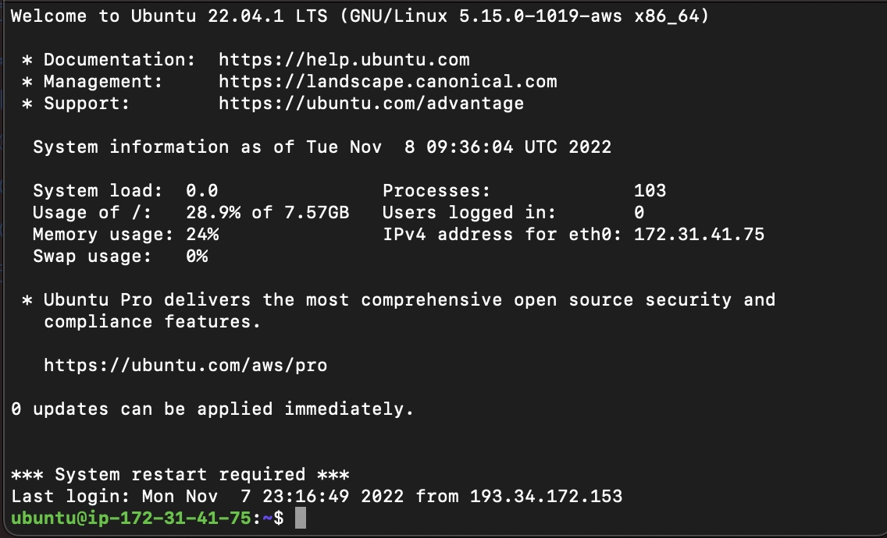

# Лабораторна робота №5
## ** Деплой проекту на AWS EC2**
<br>
Виконав студент 2 курсу <br>
ФІТ ІПЗ-1.2 <br>
Липчей Владислав Васильович

&nbsp;
### **Для початку треба вибрати образ убунту в ec2 management console і додати його собі**


### **Далі я створюю ключ з назвою lab.pem, а також даю дозвіл на http трафік на порт 80**

### **Образ вдало встановлено**

### **Переношу скачаний файл в папку з лабораторною роботою, та по інструкції даю 400 права для ключа та запускаю віддалену машину**
```
 ssh -i "lab.pem" ubuntu@ec2-52-59-148-202eu-central-1.compute.amazonaws.com

```

### **Cтвоюю html файл в папці та архівую його**
### **На віддалену машину встановлюю апач сервер за допомогою команд.  Також я встановлю unzip для подальшого розархівування мого html файла**
```
 sudo apt-get update
 sudo apt-get install apache2
 sudo apt-get install unzip
```
### **Відправляю дані на сервер **
```
    scp -i lab.pem -r index.html.zip ubuntu@ec2-52-59-148-202.eu-central-1.compute.amazonaws.com:~/
```
### **Розархівовую файл та переношу його в директорію /var/www/html, з якої запускаються всі сторінки на сервері апач**
```
 unzip index.html.zip
  sudo mv -i index.html /var/www/html/index.html
```

### **IP адрес мої сторінки**


### **Результаbт**


