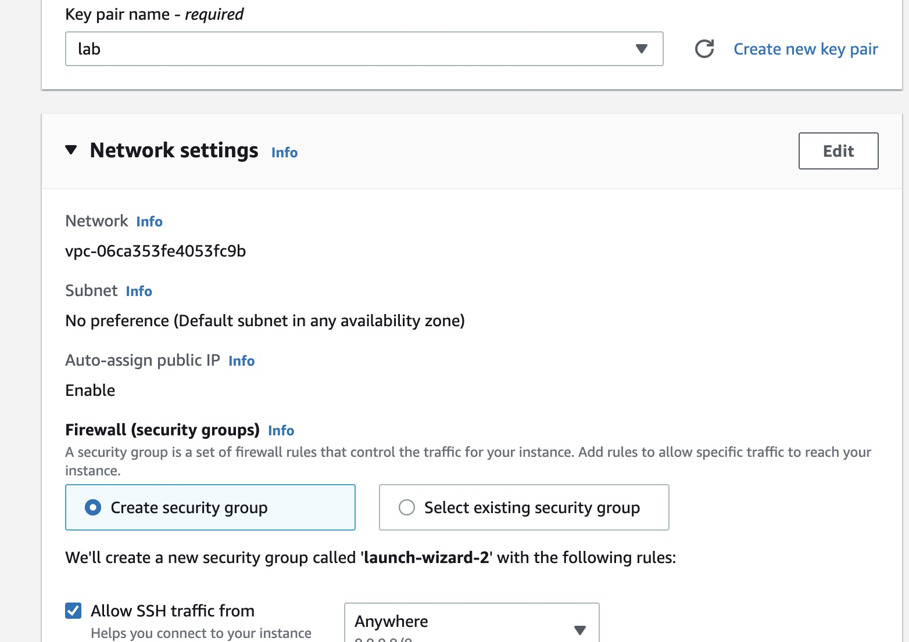
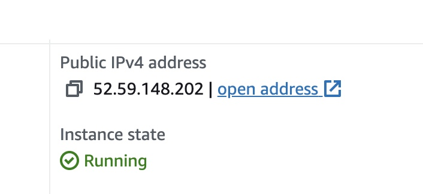
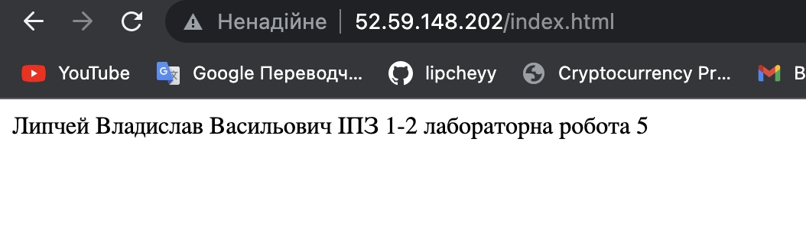

# Лабораторна робота №4
## **TERRAFORM**
 
Виконав студент 2 курсу  
ФІТ ІПЗ-1.2  
Липчей Владислав Васильович

&nbsp;
### **Для початку налаштуємо облікові дані, виберемо свій проект, та cтворимо обліковий запис для служб**

### **Вибираю роль project owner**

### **Створюю ключ в форматі json та переношу його в папку з проектом**

### **Перехожу в вкладку з образами віртуальних машин та включаю computing engines**

### **В терраформ файлі я прописую свого провайдера, ключ облікових даних, створюю 2 ресурси і пудключаю АРІ googlecompute i cloudresourcemanager, такоє прописую те що ми будемо відкривати файли на портах 443 та 80 на дефолтній мережі**

### **Тут я вказую тип віртуальної машини, та пишу скрипт для встановлення апач сервера та занесення даних в файл index.html**

### **Ініціалізую терраформ в папці проекто та виконую terraform apply**

### **Мій образ**

### **Результат готова html сторінка**

