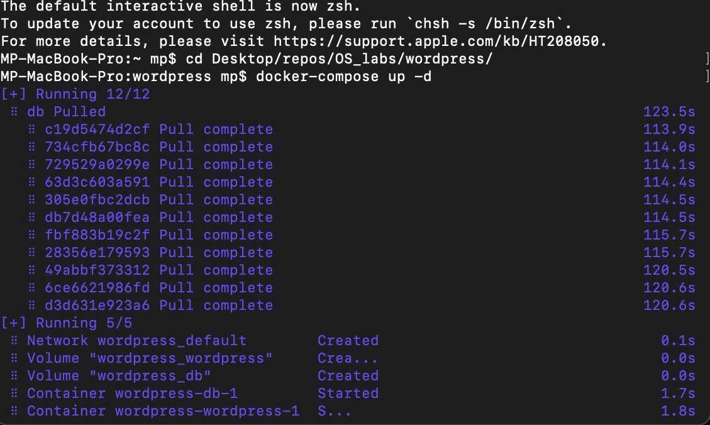
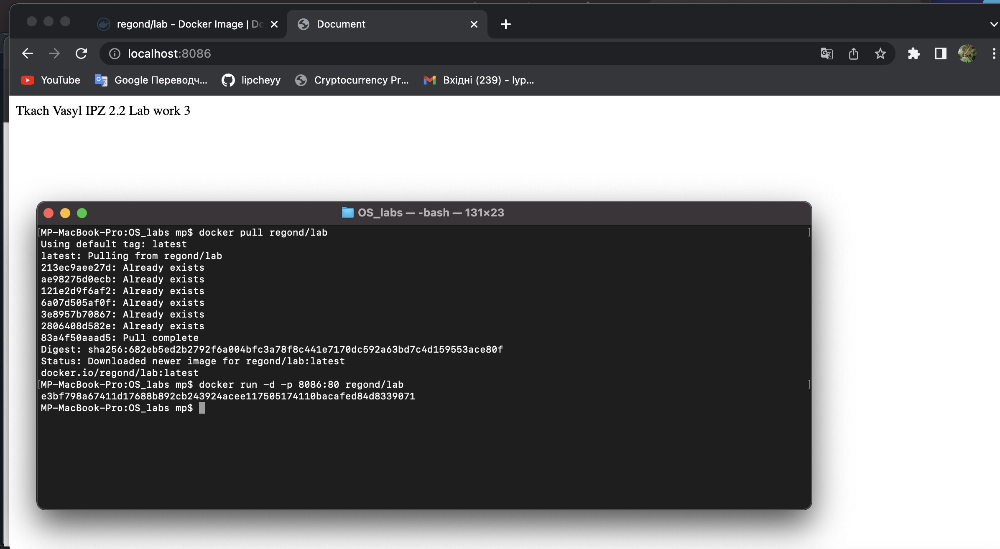

# Лабораторна робота №3
## **Docker.**
<br>
Виконав студент 2 курсу <br>
ФІТ ІПЗ-1.2 <br>
Липчей Владислав Васильович

&nbsp;
### **Використання готових Docker Images.**
Для початку я зайшов на сайт Dockerhub, де знайшов офіційний образ wordpress, та встановив собі цей образ командою
```
    docker pull wordpress
```

Далі я створив файл docker-compose.yml, в який я вставив стек з сайту


Наступним кроком було зробити пул


Тепер можна відкривати localhost на порті 8080, який вказаний в стеку, і бачити результат:


<hr>

### **Описати теоретично що таке Docker Compose, чому саме розширення .yml а також навести переваги та недоліки його використання. Навести приклад створення та збирання образа за допомогою Docker Compose.**

**Docker-compose** — це  програма яка дозволяє запускати безліч контейнерів одночасно і маршрутизувати потоки даних між ними.

**Розширення** .yml використовується тому, що в файл з таким розширенням записується код на мові YAML-це мова для запису конфігурацій даних на подобі мови JSON. Він використовує формат відступів для визначення структури.

**Переваги .yml**
 - він оптимізований для серіалізації даних, відформатованого дампу, файлів конфігурації, файлів журналу, обміну Інтернет-повідомленнями та фільтрації.
 - в мові yaml непотрібно використовувати роздільник 

**Недоліки.yml**
 - Якщо говорити про популярність, XML має набагато більш зрілу екосистему, ніж YAML
 - Існують додаткові застереження під час написання коду YAML. Навіть якщо ви неправильно вставите один пробіл під час відступу, ваш код може перестати працювати.
 - Існує багато способів представлення даних у YAML та створення ієрархії даних. Тому він складний для обробки. Тому JSON і XML мають кращу продуктивність, ніж YAML.
**Приклад** збирання образа: запуск сторінки wordpress.
<hr>

&nbsp;
### **Створення HTML сторінки та занесення її в Docker Image. Залити даний Docker Image на Docker Hub.**

- Створити HTML сторінку із вашим ПІБ, групою та № Л.Р..
- Створити Docker Image із цією сторінкою.
- Реалізувати можливість запуску цієї сторінки з контейнера (потрібно sudo usermod -aG docker username сервер NGINX до прикладу). 
- Перевірити на працездатність контейнера на основі вашого образу. 
- Залити готовий образ на Docker Hub.

Для цього нам потрібні 2 файли:
 - index.html
 - Dockerfile

вмістиме Dockerfile:
    
        FROM nginx:alpine
        COPY . /usr/share/nginx/html
Далі створюємо образ labwork і розгортаємо його на порті 8080


Результат


**Заливаємо образ на dockerhub**

Для початку я створю пустий репозиторій, його я назву так само як свій образ

.


Далі створюю ще 1 образ з таким самим іменем, але перед назвою дописую назву свого акаунту на docker hub пушу на віддалений репозиторій


Далі пушу на віддалений репозиторій


Посилання на [репозиторій](https://hub.docker.com/repository/docker/vladlipchey/labwork)
<hr>

### **Скачати Docker Image когось із групи і розвернути в себе контейнер з HTML сторінкою на порті 8086 ззовні.**
В себе я буду показувати це [репозиторій](https://hub.docker.com/repository/docker/regond/lab). Для початку я склоную собі цей образ


Тепер я розгорну його в себе на порті 8086 командою
```
    docker run -d -p 8086:80 regond/lab
```
.

