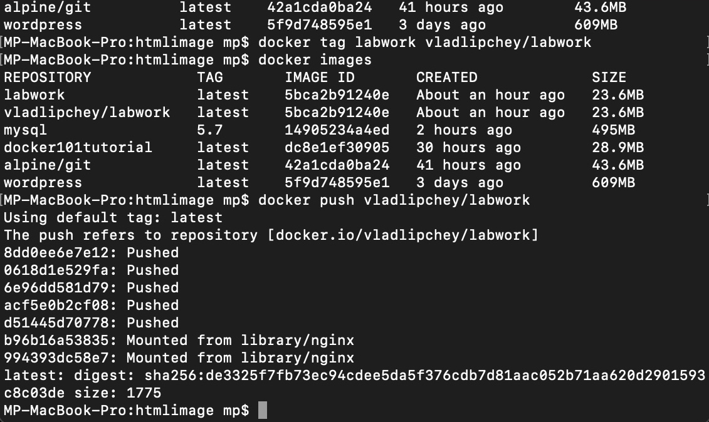

# Лабораторна робота №3
## **Docker.**
<br>
Виконав студент 2 курсу <br>
ФІТ ІПЗ-1.2 <br>
Липчей Владислав Васильович

&nbsp;
### **Використання готових Docker Images.**
Для початку я зайшов на сайт Dockerhub, де знайшов офіційний образ wordpress, та встановив собі цей образ командою
```
    docker pull wordpress
```

Далі я створив файл docker-compose.yml, в який я вставив стек з сайту


Наступним кроком було зробити пул


Тепер можна відкривати localhost на порті 8080, який вказаний в стеку, і бачити результат:


<hr>

### **Описати теоретично що таке Docker Compose, чому саме розширення .yml а також навести переваги та недоліки його використання. Навести приклад створення та збирання образа за допомогою Docker Compose.**

**Docker-compose** — це  програма яка дозволяє запускати безліч контейнерів одночасно і маршрутизувати потоки даних між ними.

**Розширення** .yml використовується тому, що в файл з таким розширенням записується код на мові YAML-це мова серіалізації даних на подобі мови JSON. Він використовує формат відступів для визначення структури.

Приклад збирання образа: запуск сторінки wordpress.
<hr>

&nbsp;
### **Створення HTML сторінки та занесення її в Docker Image. Залити даний Docker Image на Docker Hub.**

- Створити HTML сторінку із вашим ПІБ, групою та № Л.Р..
- Створити Docker Image із цією сторінкою.
- Реалізувати можливість запуску цієї сторінки з контейнера (потрібно sudo usermod -aG docker username сервер NGINX до прикладу). 
- Перевірити на працездатність контейнера на основі вашого образу. 
- Залити готовий образ на Docker Hub.

Для цього нам потрібні 2 файли:
 - index.html
 - Dockerfile

вмістиме Dockerfile:
    
        FROM nginx:alpine
        COPY . /usr/share/nginx/html
Далі створюємо образ labwork і розгортаємо його на порті 8080


Результат


**Заливаємо образ на dockerhub**

Для початку я створю пустий репозиторій 


Далі пушу на віддалений репозиторій
.

